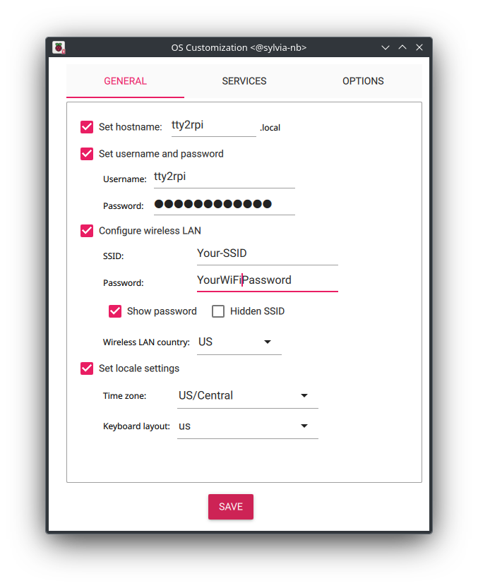
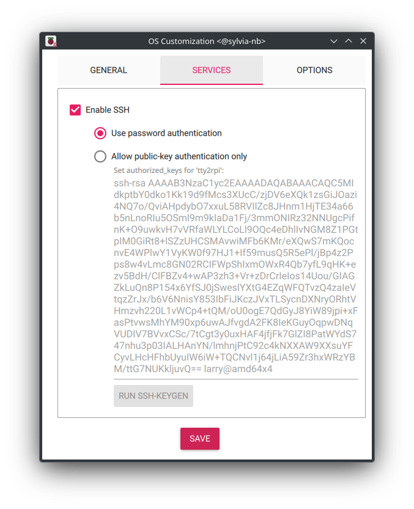

Table of Contents  
[Hardware](#hardware)  
[Setting up the Raspberry Pi](#setting-up-the-raspberry-pi)  
[The INI files](#the-ini-files)  
[Alternative serial setup](#alternative-serial-setup)  
[Media](#media)  
[Commands](#commands)  
[NetworkManager](#networkmanager)  
[Network Access](#network-access)  
[OS updates](#os-updates)  
[Bugs and things to do](#bugs-and-things-still-to-do)  
[License](#license)  

---

## Deprecation warning(s)
- Removed as announced  
~~fbcp-ili9341 for SPI displays. Will be removed 2026/01, also any support for these displays types. A more modern display driver [is available](https://github.com/notro/panel-mipi-dbi/wiki) but due its complexity you are on your own activating and using it (but I still accept "issues" about it)~~

---

# Hardware

You obviously need a Rasoberry Pi. This is descibed in it's own chapter.  
I'm using [this display](https://www.amazon.de/dp/B08R5MFN5P) (not an affiliate link) as it's BIG in size, using HMDI and sound and fits my idea of a Marquee display. 
*Any* HDMI display will do in principle, but you'll need to have and use appropriate media files then.  
A new feature was added at the end of 2023: You can now use almost any SPI, DSI and DPI display. See /boot/config.txt.example for some examples.

---

# Setting up the Raspberry Pi

I assume that you are already familiar with setting up a Raspberry Pi. We are going to using Debian Trixie, the current version of Debian.

Obviously you need a Raspberry Pi. Any model except the Pico will do, but remember that - even a RPi1 will
do a fine job - the faster the RPi is, the more responsive your experience will be.
From my personal experience a good minimum is the RPi2, better would be a RPi3. A good choice regarding
price/power a RPi 3A+

[Download and start the Raspberry Pi Imager,](https://www.raspberrypi.com/software/) insert a SD card, choose your Raspberry Pi Model, the OS version (standard 32- or 64-bit w/o desktop ("Lite") recommended) and the SD card you want to write to. If you are using Raspberry Pi 3 or newer, choose the 64-bit OS. 32-bit is "legacy", old and rusted. Now click on the button **Next**.  
Click on the first button to edit settings as shown below, but be sure to set **your own** WiFi credentials & country and time zone 😉  
General Settings           |  Services Settings
:-------------------------:|:-------------------------:
   |  

Insert the SD into your RPi, connect all needed cables and devices and boot up your RPi.  
<ins>If not already done with the Raspberry Pi Imager:</ins> Follow the instruction shown on the screen and setup your user and password. For simplicity you can create a user **tty2rpi** (see also at end of this paragraph). Enable and setup WiFi if you want to use it.

Update your Raspberry Pi OS and install the following packages:

```
sudo apt update && sudo apt dist-upgrade
```
```
sudo apt install mc dos2unix rsync git bc inotify-tools netcat-openbsd flex bison p7zip-full readline-common ncurses-base xorg xserver-xorg-video-fbdev openbox imagemagick vlc ffmpeg feh fim mplayer mpv plocate ksmbd-tools
```

Optional: Disable some services to save some memory and to speed up boot time:
```
sudo systemctl disable avahi-daemon.service avahi-daemon.socket bluetooth.service ModemManager.service
```

Optional: Disable cloud things
```
sudo touch /etc/cloud/cloud-init.disabled
```

Enable SSH (it not already done in the RPi imager):
```
sudo systemctl enable ssh.service
```

Get and run the install/update script:
```
wget https://raw.githubusercontent.com/ojaksch/MiSTer_tty2rpi/main/update_tty2rpi.sh -O - | bash -
```
Files that will be created;
- /boot/firmware/cmdline.txt.example -- compare with your existing cmdline.txt. The only relevant changes here are the parameters *quiet* and *cfg80211.ieee80211_regdom=COUNTRYCODE*. [See here](https://www.arubanetworks.com/techdocs/InstantWenger_Mobile/Advanced/Content/Instant%20User%20Guide%20-%20volumes/Country_Codes_List.htm) for a list of WiFi regulatory domains.
- /boot/firmware/config.txt.example -- compare with and edit your existing config.txt. Changes are:
	```
	...
	#dtoverlay=vc4-kms-v3d
	...
	[all]
	disable_splash=1
	```
	
	Use ```dtoverlay=vc4-kms-v3d``` for a standard HDMI setup or ```#dtoverlay=vc4-kms-v3d``` for other display types and have a look above the ```# -----------``` line for examples.

- /etc/X11/xorg.conf.d/10-monitor.conf -- Monitor config file that disables DPMS
- /tmp/home/tty2rpi/ -- User files that will be copied to the user you have created - this is "the engine"
- /usr/local/bin/ -- Needed and needful programs

Read on the next chapters for the media content and a readup of the INI fles. When done, just reboot your RPi and continue 
with [setting up the MiSTer](/2-Setup-MiSTer.md)

---

# Alternative serial setup

If your going **not** to use WiFi (or whatever your intention is), you can use a serial connection. Buy and use a simple USB2Serial adapter, connect the USB part to your MiSTer and the loose cables to the RPi as shown below, but **do not use the red wire** which is carrying a voltatge of 3V or 5V and **might destroy your RPi**!


- Edit RPi's */boot/firmware/cmdline.txt* and change the part ```console=serial0,115200``` to ```console=tty3```
- Edit */boot/firmware/config.txt* and enable the last two line so they're reading  
	```
	[all]
	enable_uart=1
	dtoverlay=disable-bt
	# Enable the next lines (by removing the leading #) when using a RPi5 and the 	GPIO based serial connection.
	# Do not enable when using the RPi5 specific 3-Pin UART cable.
	#dtparam=uart0           # Enable UART0/ttyAMA0 on GPIO 14 & 15
	#dtparam=uart0_console   # Enable UART0/ttyAMA0 on GPIO 14 & 15 and make it 	the console UART
	```
- In *~/tty2rpi-user.ini* set SERIALSOCKET="yes" or "gpio" (RPi up to 4 or RPi 5 with GPIO based connection), "uart" (RPi 5 UART connection)
- Disable Bluetooth modems which are connected via UART  
```sudo systemctl disable hciuart```
- Don't forget to set two parameters in MiSTer's ```/media/fat/tty2rpi/tty2rpi-user.ini```:  
	```
	TTYDEV="/dev/ttyUSB0"
	TTYPARAM="115200 cs8 raw -parenb -cstopb -hupcl -echo"
	```

---

# The INI files

There are two INI files: **tty2rpi.ini** and **tty2rpi-user.ini** which are read and evaluated by 
the daemon in that order. tty2rpi-user.ini is overwriting values done by tty2rpi.ini  
tty2rpi.ini contains the system wide variables and definitions. Do not edit this file as it will be overwritten when doing an update!  
For your own favorite variables please use tty2rpi-user.ini and take over and edit the needed line 
from tty2rpi.ini. All useful variables are commented - see "# Userdata" in tty2rpi.ini

---

# Media

You can create and use your own media files or
[get all the Marquee pictures](https://www.progettosnaps.net/marquees/) from progetto-SNAPS (or search for MAME's *marquees.zip* - there are many similar projects providing HQ Marquee sized images) 
[and the Marquee videos](https://www.arcadepunks.com/marquees-digital-marquees-cab-2/#google_vignette) from Arcade Punks
and store them on you RPi's SD card, on your NAS or wherever you want, as long as they are accessable by the OS' file system. Don't forget to mount the file system 
if needed and set their destination variables in **$HOME/tty2rpi-user.ini**  
The default set in **tty2rpi.ini** is
```
PATHPIC="${HOME}/marquee-pictures"
PATHVID="${HOME}/marquee-videos"
```
for RPi's SD in your created user's home.

~~You'll find some additional media files in the folder *media_files_rpi* of this repository. Copy the pictures to your created PATHPIC and 
*MISTER-MENU.mp4* to PATHVID, but renamed to MENU.png and MENU.mp4 when you are setting up tty2rpi for MiSTer, otherwise, when setting up tty2rpi for 
MAME, copy *MAME-MENU.png* and *MAME-MENU.mp4* without renaming it.~~

Paths are now predefined and already filled with some files for easier setup. Don't forget to copy these files to another folder or mount point, if changed by you.

---

# Commands

The commands available on RPi's side are handled by the Daemon (tty2rpi.sh) itself and are flexible...just create a file with the name of the command plus 
the extension of ".sh" (e.g. **~/tty2rpi-scripts/CMDHELLO.sh**), set file's attribute to "executable" and copy/write your script into that file. That's easy, isn't it?

Send the command from your client through the defined TCP socket (e.g.
```
echo "CMDHELLO,1st_parameter,2nd_parameter" > /dev/tcp/IP-ADDRESS-OF-RPI/6666)
```
As you can see, (many) parameters are possible and a comma sign is used as separator. No spaces are allowed as they're also interpreted as separator.  
Have a look at the already existing scripts in **~/tty2rpi-scripts/** to get an idea.

Available commands:
| Command                         | Description                              |
| ------------------------------- |----------------------------------------- |
| CMDCOR§PARAM§PARAM              | Shows a video and/or picture named PARAM |
| CMDSHOWCPU                      | Shows CPU informations                   |
| CMDSHOWIPS                      | Shows RPi's IP address(es)               |
| CMDSHUTDOWN                     | Shutdown the RPi                         |

---

# NetworkManager

Debian Trixie is now the actual version for our Raspberry's. If you are going to upgrade to Trixie, you may stumble about a change how networking is done now as they are using NetworkManager for managing networks.

For WiFi setups: After upgrading but before rebooting, create a file named /etc/NetworkManager/system-connections/wlan.nmconnection and copy and edit this code snipped

```
[connection]
id=YourOwnSSID-Or-Name
uuid=26cbd98d-c857-4b9e-a313-0a07bea76d55
type=wifi
interface-name=wlan0

[wifi]
mode=infrastructure
ssid=YourOwnSSID

[wifi-security]
auth-alg=open
# for WPA2 or mixed WPA2/WPA3
key-mgmt=wpa-psk
# for WPA3
# key-mgmt=sae
psk=YourVeryStrongAndSecretPassword

[ipv4]
method=auto

[ipv6]
addr-gen-mode=default
method=auto

[proxy]
```

Edit id, ssid and psk for your needs, quit editor, set the correct file mode bits and disable wpa_supplicant

```
chmod 600 /etc/NetworkManager/system-connections/wlan.nmconnection
```

Reboot and all should work.

- Revise and publish the documentation for MAME

---

# Network Access

To access you tty2rpi device you can use *ssh, scp* or just any SMB based network tool.  

Keep in mind that if you have used another user than *tty2rpi* while creating your SD card or setting up your OS otherwise, that you have to adjust the file */etc/ksmbd/ksmbd.conf* accordingly.

---

# OS updates

It is always a good idea to keep you OS updated. This could be automated as known with Windows, but then you are missing any detail what has been updated and could be reported if anything breaks (unlikely, but possible). Updates should be done regularly, but not necessarily every day or week. This is an advice, not a must.  
Don't panic! We're on Linux here, not Windows or MacOS and your tty2rpi system isn't driving a nuclear plant.

Regular updates are helping in updating software in general, fixing bugs, broken programs or libraries and the underlying OS itself, which could bring new or better device drivers to you. I don't want to delve too deeply into the subject here. You're running an operating system, so you should take care of it and familiarize yourself with it. But in short, and this is usual way, open a console on your device and enter

```
sudo apt update && sudo apt dist-upgrade
```

"&&" is a separator and means that if "apt update" (freshen up software libraries) ran successfully, continue with "apt dist-upgrade" and start the actual update. Carefully read messages and prompts, press Enter and let it roll. When it's done and no errors were reported, you should (optionally) reboot the device. That's all.

The RPi400, RPi4B and RPi5 devices are in a special position, because they are having an EEPROM (think of a BIOS). Nothing you can enter and edit like on a regular PC, but is very similar. Updates to the EEPROM aren't done automagically and must be performed manually. These updates are rarer but even more important. They are bringing updates and fixes to the EEPROM/BIOS/Firmware, like a new/better support for the internal gfx device, GPIO things, NVME devices or serial I/O (Aah! Remember the last reports about "damn, the serial connection won't work and I've done all correct!" ?)

Again, no deep dive into the subject here, read the following articles to get an idea about the what and why's. This only looks complicated at first glance. No Russian rocket science here.

[Geekworm: How to update eeprom firmware](https://wiki.geekworm.com/How_to_update_eeprom_firmware)  
[Raspberry Foundation: Raspberry Pi boot EEPROM](https://www.raspberrypi.com/documentation/computers/raspberry-pi.html#raspberry-pi-boot-eeprom)

---

# Bugs and things still to do

- If your are getting a <ins>blank screen only</ins> after booting, you could try to set one or all HDMI related settings in *config.txt*: __hdmi_safe__, __hdmi_force_hotplug__ and __hdmi_drive__
Another hint, especially when using a RPi5, could be to set __vc4.force_hotplug=3__ in *cmdline.txt* - see [that issue](https://github.com/ojaksch/MiSTer_tty2rpi/issues/5) we had in the past.
- If you end up getting a <ins>blank screen with a blinking cursor</ins> in the top left corner, login to another console at tty2 (by pressing ALT + F2) or ssh to your RPi and start an editor by typing in
	
	```
	sudo pico /etc/X11/xorg.conf.d/99-vc4.conf
	```
	
	In the editor copy & paste the following text:
	
	```
	Section "OutputClass"
	  Identifier "vc4"
	  MatchDriver "vc4"
	  Driver "modesetting"
	  Option "PrimaryGPU" "true"
	EndSection
	```
	
	Press CTRL + O, then Enter to save the file, press CTRL + X to leave the editor. Reboot your RPi by either hitting CTRL + ALT + DEL, by typing
	
	```
	sudo systemctl reboot
	```
	
	or by typing
	
	```
	killall openbox
	```

---

# License

  
[Attribution-NonCommercial-ShareAlike 4.0 International (CC BY-NC-SA 4.0)](https://creativecommons.org/licenses/by-nc-sa/4.0/)
